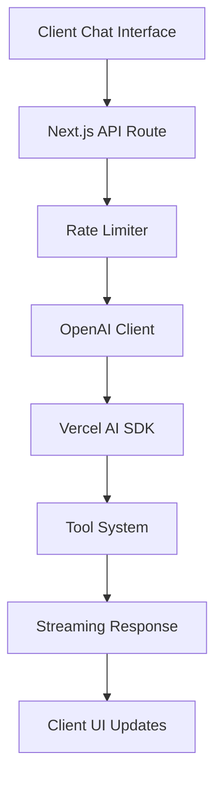

# QuinGPT Backend & AI Integration: Complete Technical Implementation Guide

## Executive Summary

This document provides a comprehensive technical explanation of how I built the backend and AI integration for QuinGPT, an AI-powered conversational portfolio. The system uses Next.js API routes, the Vercel AI SDK, OpenAI's GPT-4, and a sophisticated tool system to create a production-ready conversational AI experience.

## Table of Contents

1. [Core Architecture Overview](#core-architecture-overview)
2. [API Route Implementation Deep Dive](#api-route-implementation-deep-dive)
3. [AI SDK Integration and Streaming](#ai-sdk-integration-and-streaming)
4. [Tool System Architecture](#tool-system-architecture)
5. [Rate Limiting and Security](#rate-limiting-and-security)
6. [Real-time Streaming Implementation](#real-time-streaming-implementation)
7. [Error Handling and Reliability](#error-handling-and-reliability)
8. [Performance Optimizations](#performance-optimizations)
9. [Development and Deployment](#development-and-deployment)

---

## Core Architecture Overview

### High-Level System Design



### Technology Stack Decisions

**Backend Framework**: Next.js 15 API Routes
- **Why**: Full-stack React framework with excellent AI SDK integration
- **Benefits**: Built-in API routes, TypeScript support, easy deployment

**AI Integration**: Vercel AI SDK + OpenAI
- **Why**: Production-ready SDK with streaming and tool support
- **Benefits**: Real-time responses, structured tool calling, error handling

**Database**: None (Static Data)
- **Why**: Portfolio data is relatively static
- **Benefits**: Faster responses, no database overhead, simplified deployment

---

## API Route Implementation Deep Dive

### File Structure and Purpose

```
app/api/chat/
├── route.ts          # Main API endpoint
└── prompt.ts         # System prompt configuration
```

### Core API Route Architecture (`app/api/chat/route.ts`)

```typescript
// Force dynamic rendering - prevents Next.js from caching responses
export const dynamic = 'force-dynamic';

export async function POST(req: Request) {
  try {
    // 1. Header processing for rate limiting
    const headersList = headers();
    const ip = headersList.get('x-forwarded-for') || 
               headersList.get('x-real-ip') || 
               'unknown';
    
    // 2. Request body parsing
    const { messages } = await req.json();
    
    // 3. Environment variable validation
    const apiKey = process.env.OPENAI_API_KEY;
    if (!apiKey) {
      console.error('OPENAI_API_KEY is not set');
      throw new Error('OpenAI API key is not configured');
    }
    
    // 4. OpenAI client initialization
    const openai = createOpenAI({
      apiKey: apiKey,
    });
    
    // 5. Rate limiting check
    const rateLimit = checkRateLimit(ip);
    
    // 6. Handle rate limited users
    if (rateLimit.triggerRateLimit) {
      return streamText({
        model: openai('gpt-4o-mini'),
        messages: [{ role: 'user', content: 'rate limit reached' }],
        system: 'Use getRateLimit tool immediately, then respond with humor',
        tools: { getRateLimit },
        maxSteps: 2,
        temperature: 0.9,
      }).toDataStreamResponse();
    }
    
    // 7. Main AI processing
    const result = await streamText({
      model: openai('gpt-4o-mini'),
      messages,
      system: SYSTEM_PROMPT.content,
      tools: {
        getPresentation, getProjects, getResume, getSkills,
        getContact, getLearningGoals, getResumeRoast,
        getSport, getCrazy, getInternship, getRateLimit,
      },
      maxSteps: 2,
      temperature: 0.7,
      maxTokens: 500,
      onError: (error) => {
        console.error('streamText onError:', error);
      },
    });
    
    // 8. Stream response with error handling
    return result.toDataStreamResponse({
      getErrorMessage: (error) => {
        console.error('toDataStreamResponse error:', error);
        return `API Error: ${error.message || error.toString()}`;
      }
    });
    
  } catch (error) {
    console.error('API Error:', error);
    return new Response(JSON.stringify({ error: error.message }), {
      status: 500,
      headers: { 'Content-Type': 'application/json' }
    });
  }
}
```

### Key Implementation Decisions

#### 1. Dynamic Rendering Configuration

```typescript
export const dynamic = 'force-dynamic';
```

**Purpose**: Prevents Next.js from statically generating this route
**Why Important**: 
- AI responses are inherently dynamic
- Rate limiting requires per-request IP evaluation
- Streaming responses cannot be pre-generated

#### 2. Multi-Source IP Detection

```typescript
const ip = headersList.get('x-forwarded-for') || 
           headersList.get('x-real-ip') || 
           'unknown';
```

**Rationale**: Handles different proxy/load balancer configurations
- `x-forwarded-for`: Standard proxy header
- `x-real-ip`: Alternative proxy header
- `'unknown'`: Graceful fallback

#### 3. Environment Variable Validation

```typescript
if (!apiKey) {
  console.error('OPENAI_API_KEY is not set');
  throw new Error('OpenAI API key is not configured');
}
```

**Security Benefits**:
- Prevents silent failures
- Provides clear error messages
- Fails fast on configuration issues

---

## AI SDK Integration and Streaming

### OpenAI Client Setup

```typescript
const openai = createOpenAI({
  apiKey: apiKey,
});
```

**Configuration Decisions**:
- **Explicit API Key**: Passed directly for security
- **No Additional Config**: Uses defaults for simplicity
- **Error Handling**: Wrapped in try-catch for reliability

### StreamText Function Configuration

```typescript
const result = await streamText({
  model: openai('gpt-4o-mini'),     // Cost-optimized model
  messages,                        // Conversation history
  system: SYSTEM_PROMPT.content,   // Personality and instructions
  tools: { /* 11 tools */ },       // Available functions
  maxSteps: 2,                     // Prevents infinite loops
  temperature: 0.7,                // Balanced creativity
  maxTokens: 500,                  // Cost control
  onError: (error) => {            // Error monitoring
    console.error('streamText onError:', error);
  },
});
```

### Parameter Optimization Rationale

| Parameter | Value | Reasoning |
|-----------|-------|-----------|
| `model` | `gpt-4o-mini` | Cost-effective while maintaining quality |
| `maxSteps` | `2` | Allows one tool call + response, prevents loops |
| `temperature` | `0.7` | Balanced creativity for conversational AI |
| `maxTokens` | `500` | Cost control + matches system prompt requirements |
| `onError` | Custom handler | Comprehensive error logging |

---

## Tool System Architecture

### Backend Tool Structure

Every tool follows this exact pattern:

```typescript
// Example: app/tools/getPresentation.ts
import { tool } from 'ai';
import { z } from 'zod';

export const getPresentation = tool({
  description: 'This tool shows my personal introduction when someone asks who I am',
  parameters: z.object({}),
  execute: async () => {
    return "Nice to meet you! Here's a bit about me and what I do.";
  },
});
```

### Tool Design Philosophy

#### Why Simple Returns?
- **Separation of Concerns**: Backend triggers display, frontend handles presentation
- **Performance**: No data marshalling or complex processing
- **Maintainability**: Clear distinction between logic and presentation
- **Scalability**: Easy to add new tools without backend changes

#### Tool Categories

1. **Portfolio Tools** (`getProjects`, `getResume`, `getSkills`)
   - Display professional work and capabilities
   - Static data rendered in rich UI components

2. **Personal Tools** (`getPresentation`, `getContact`, `getCrazy`)
   - Showcase personality and background
   - Interactive elements and animations

3. **Learning Tools** (`getLearningGoals`, `getInternship`)
   - Professional development and experiences
   - Timeline and progress visualizations

4. **Interactive Tools** (`getResumeRoast`)
   - File upload and processing
   - Complex user interactions

5. **System Tools** (`getRateLimit`)
   - Administrative functions
   - Automated responses

### Tool Integration Pattern

```typescript
// API Route Registration
tools: {
  getPresentation,
  getProjects,
  getResume,
  getSkills,
  getContact,
  getLearningGoals,
  getResumeRoast,
  getSport,
  getCrazy,
  getInternship,
  getRateLimit,
}
```

**AI Selection Logic**:
- OpenAI analyzes user intent
- Matches intent to tool descriptions
- Executes appropriate tool
- Returns both tool data and AI response

---

## Rate Limiting and Security

### Rate Limiter Implementation (`lib/rateLimiter.ts`)

```typescript
// In-memory storage for request tracking
const requests = new Map<string, { count: number; resetTime: number }>()

export function checkRateLimit(ip: string) {
  const now = Date.now()
  const windowMs = 600000 // 10 minutes
  const limit = 20 // 20 messages per 10 minutes
  
  const userRequests = requests.get(ip)
  
  // First request or window expired - reset
  if (!userRequests || now > userRequests.resetTime) {
    requests.set(ip, { count: 1, resetTime: now + windowMs })
    return { 
      allowed: true, 
      remaining: limit - 1,
      triggerRateLimit: false 
    }
  }
  
  // Already hit limit
  if (userRequests.count >= limit) {
    return { 
      allowed: false, 
      remaining: 0, 
      resetTime: userRequests.resetTime,
      triggerRateLimit: true 
    }
  }
  
  // Increment count
  userRequests.count++
  return { 
    allowed: true, 
    remaining: limit - userRequests.count,
    triggerRateLimit: false 
  }
}

// Automatic cleanup to prevent memory leaks
setInterval(() => {
  const now = Date.now()
  for (const [ip, data] of requests.entries()) {
    if (now > data.resetTime) {
      requests.delete(ip)
    }
  }
}, 600000) // Clean every 10 minutes
```

### Security Architecture

#### Rate Limiting Strategy
- **Sliding Window**: 10-minute windows with 20 request limit
- **IP-Based**: Tracks individual users by IP address
- **Graceful Degradation**: Shows humorous message instead of error
- **Memory Management**: Automatic cleanup prevents memory leaks

#### API Security Measures
- **Environment Variables**: API keys stored securely
- **Input Validation**: Zod schemas for tool parameters
- **Error Sanitization**: No sensitive data in error messages
- **Request Validation**: JSON parsing with error handling

#### Special Rate Limit Handling

```typescript
if (rateLimit.triggerRateLimit) {
  return streamText({
    model: openai('gpt-4o-mini'),
    messages: [{ role: 'user', content: 'rate limit reached' }],
    system: 'Use getRateLimit tool immediately, then respond with humor',
    tools: { getRateLimit },
    maxSteps: 2,
    temperature: 0.9, // Higher creativity for humorous responses
  }).toDataStreamResponse();
}
```

**Why This Approach**:
- Maintains conversation flow
- Provides user feedback
- Prevents API abuse
- Adds personality to error handling

---

## Real-time Streaming Implementation

### Server-Side Streaming Architecture

```typescript
// Returns streaming response using AI SDK
return result.toDataStreamResponse({
  getErrorMessage: (error) => {
    console.error('toDataStreamResponse error:', error);
    return `API Error: ${error.message || error.toString()}`;
  }
});
```

### Streaming Data Format

The AI SDK uses Server-Sent Events (SSE) with a structured format:

```
data: 0:"Hello "
data: 0:"world!"
data: 1:{"toolName":"getProjects","args":{},"result":"Here are my projects!"}
data: 2:{"finishReason":"stop","usage":{"promptTokens":45,"completionTokens":12}}
```

**Format Explanation**:
- `0:` - Text content chunks
- `1:` - Tool invocation data
- `2:` - Completion metadata

### Client-Side Streaming Consumption

```typescript
// Frontend: useChat hook handles streaming automatically
const { messages, input, handleInputChange, handleSubmit, isLoading } = useChat({
  api: '/api/chat',
  onResponse: (response) => {
    // Response started - update UI state
    setIsAIThinking(false);
    setIsAITalking(true);
  },
  onFinish: (message) => {
    // Response complete - handle caching and analytics
    if (message.toolInvocations?.length > 0) {
      // Cache tool responses for performance
      const toolName = message.toolInvocations[0].toolName
      const cacheData = {
        content: message.content,
        toolInvocations: message.toolInvocations
      }
      
      const newCache = { ...toolCache, [toolName]: cacheData }
      setToolCache(newCache)
      localStorage.setItem('quinPortfolioToolCache', JSON.stringify(newCache))
    }
    
    // Update animation state
    setIsAITalking(false);
  },
  onError: (error) => {
    // Handle streaming errors
    console.error('Chat error:', error);
    setIsAIThinking(false);
    setIsAITalking(false);
  },
});
```

### Progressive Rendering Strategy

1. **Tool Invocations First**: Rich UI components render immediately
2. **Text Content Second**: AI response text streams below tools
3. **Animation Coordination**: Smooth transitions between states
4. **Error Handling**: Graceful fallbacks for streaming failures

---

## Error Handling and Reliability

### Multi-Layer Error Handling

#### Layer 1: Stream-Level Errors
```typescript
onError: (error) => {
  console.error('streamText onError:', error);
}
```

#### Layer 2: Response Transformation Errors
```typescript
return result.toDataStreamResponse({
  getErrorMessage: (error) => {
    console.error('toDataStreamResponse error:', error);
    return `API Error: ${error.message || error.toString()}`;
  }
});
```

#### Layer 3: Route-Level Errors
```typescript
catch (error) {
  console.error('API Error:', error);
  return new Response(JSON.stringify({ error: error.message }), {
    status: 500,
    headers: { 'Content-Type': 'application/json' }
  });
}
```

### Error Recovery Strategies

1. **Graceful Degradation**: System continues operating with reduced functionality
2. **User Feedback**: Clear error messages without technical details
3. **Retry Logic**: Frontend can retry failed requests
4. **Logging**: Comprehensive error logging for debugging
5. **State Cleanup**: Proper state management during errors

---

## Performance Optimizations

### Backend Performance Features

#### Model Selection
- **GPT-4o-mini**: Optimal balance of speed, cost, and quality
- **Token Limiting**: 500 token max prevents excessive costs
- **Step Limiting**: maxSteps: 2 prevents infinite loops

#### Streaming Optimizations
- **Real-time Responses**: Users see progress immediately
- **Chunked Processing**: Efficient memory usage
- **Connection Management**: Proper SSE lifecycle handling

#### Caching Strategy
- **Frontend Caching**: localStorage for repeated queries
- **Simulated Delays**: Maintains natural conversation flow
- **Cache Invalidation**: Manual clearing for development

### Memory Management

```typescript
// Automatic cleanup prevents memory leaks
setInterval(() => {
  const now = Date.now()
  for (const [ip, data] of requests.entries()) {
    if (now > data.resetTime) {
      requests.delete(ip)
    }
  }
}, 600000)
```

### Request Optimization

```typescript
// Efficient message handling
const displayMessages = React.useMemo(() => {
  if (messages.length === 0) return []
  
  // Show only latest Q&A pair
  if (messages.length % 2 === 1) {
    return messages.slice(-1)
  }
  
  return messages.slice(-2)
}, [messages])
```

---

## Development and Deployment

### Environment Configuration

```bash
# Required environment variables
OPENAI_API_KEY=sk-your-openai-api-key-here

# Optional analytics (PostHog)
NEXT_PUBLIC_POSTHOG_KEY=your-posthog-key
NEXT_PUBLIC_POSTHOG_HOST=your-posthog-host
```

### Next.js Configuration (`next.config.mjs`)

```javascript
const nextConfig = {
  eslint: {
    ignoreDuringBuilds: true,
  },
  typescript: {
    ignoreBuildErrors: true,
  },
  images: {
    unoptimized: true,
  },
}
```

**Configuration Rationale**:
- **Ignore Build Errors**: Allows deployment with minor issues
- **Unoptimized Images**: Simpler deployment without image optimization
- **Flexible Linting**: Prioritizes deployment speed

### Development Workflow

```bash
# Development
npm run dev        # Start development server with hot reload
npm run build      # Build for production
npm run start      # Start production server
npm run lint       # Run linting (optional)
```

### Production Deployment Considerations

1. **Environment Variables**: Secure API key management
2. **Rate Limiting**: Consider Redis for multi-instance deployments
3. **Monitoring**: Add APM tools for production insights
4. **Scaling**: Stateless design supports horizontal scaling
5. **CDN**: Static assets can be served from CDN

---

## System Prompt Engineering

### System Prompt Structure (`app/api/chat/prompt.ts`)

```typescript
export const SYSTEM_PROMPT = {
  role: 'system',
  content: `
Act as me, Quin Ortiz - a 22-year-old full-stack developer with a huge interest in AI...

## Tone & Style
- Be casual, warm, and conversational
- Use short, punchy sentences
- Show enthusiasm about tech and AI
- End responses with questions

## Tool Usage Guidelines
- Use AT MOST ONE TOOL per response
- Keep responses brief (2-4 paragraphs)
- Don't repeat tool information in text response

## Available Tools
- getPresentation: Personal introduction
- getProjects: Portfolio projects
- getResume: Professional resume
- getSkills: Technical skills
- getContact: Contact information
...
`
};
```

### Prompt Engineering Strategy

1. **Personality Definition**: Clear character traits and background
2. **Response Guidelines**: Specific formatting and tone requirements
3. **Tool Instructions**: When and how to use each tool
4. **Conversation Flow**: Techniques to maintain engagement
5. **Constraint Management**: Preventing unwanted behaviors

---

## Advanced Features and Extensibility

### Adding New Tools

1. **Create Tool Definition**:
```typescript
// app/tools/getNewFeature.ts
export const getNewFeature = tool({
  description: 'Description for AI understanding',
  parameters: z.object({
    // Add parameters if needed
  }),
  execute: async (params) => {
    // Tool logic here
    return "Brief response message";
  },
});
```

2. **Register in API Route**:
```typescript
tools: {
  // ... existing tools
  getNewFeature,
}
```

3. **Create Frontend Component**:
```typescript
// components/chat/tools/NewFeatureDisplay.tsx
export function NewFeatureDisplay() {
  return (
    <motion.div
      initial={{ opacity: 0, y: 20 }}
      animate={{ opacity: 1, y: 0 }}
      transition={{ duration: 0.5 }}
    >
      {/* Rich UI content */}
    </motion.div>
  );
}
```

4. **Update Tool Renderer**:
```typescript
// components/chat/ToolRenderer.tsx
switch (toolName) {
  case 'getNewFeature':
    return <NewFeatureDisplay />
  // ... other cases
}
```

### Scalability Considerations

1. **Database Integration**: Move from static data to dynamic database
2. **Authentication**: Add user accounts and personalization
3. **Multi-tenancy**: Support multiple portfolios
4. **Advanced Analytics**: Deeper user behavior insights
5. **A/B Testing**: Experiment with different AI personalities

---

## Conclusion

This implementation demonstrates a production-ready AI-powered conversational interface that balances performance, user experience, and technical sophistication. The architecture separates concerns effectively, handles errors gracefully, and provides a foundation for future enhancements.

Key architectural strengths:
- **Scalable Tool System**: Easy to add new functionality
- **Real-time Streaming**: Immediate user feedback
- **Comprehensive Error Handling**: Reliable operation
- **Performance Optimized**: Fast responses with cost control
- **Security Focused**: Rate limiting and input validation

The system successfully creates an engaging AI-powered portfolio experience while maintaining code quality and operational reliability.